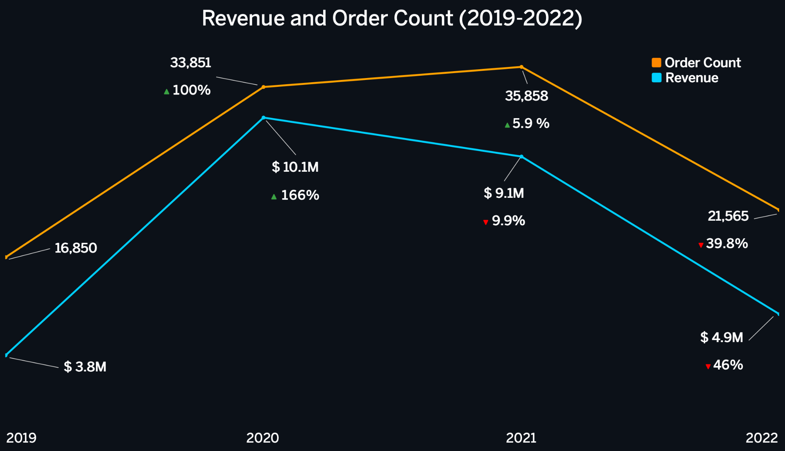
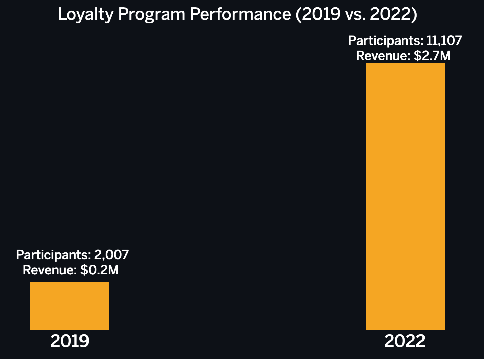
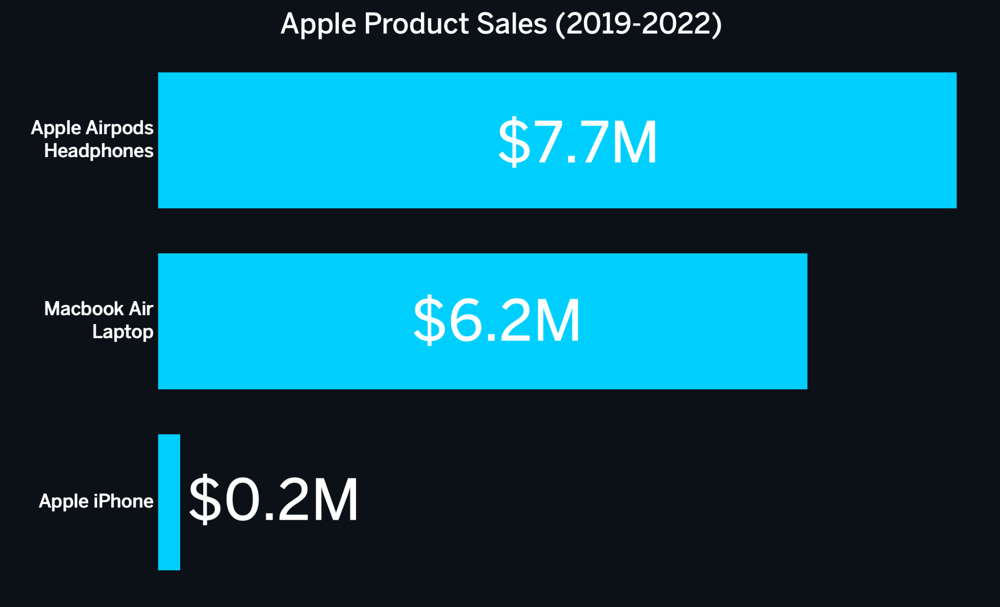
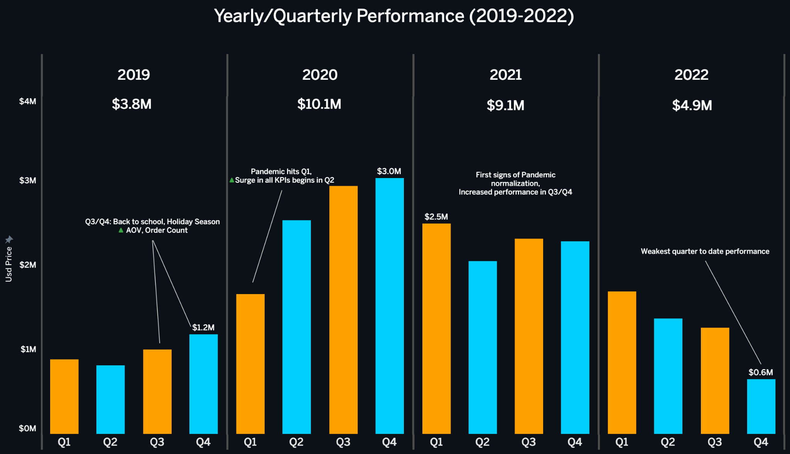
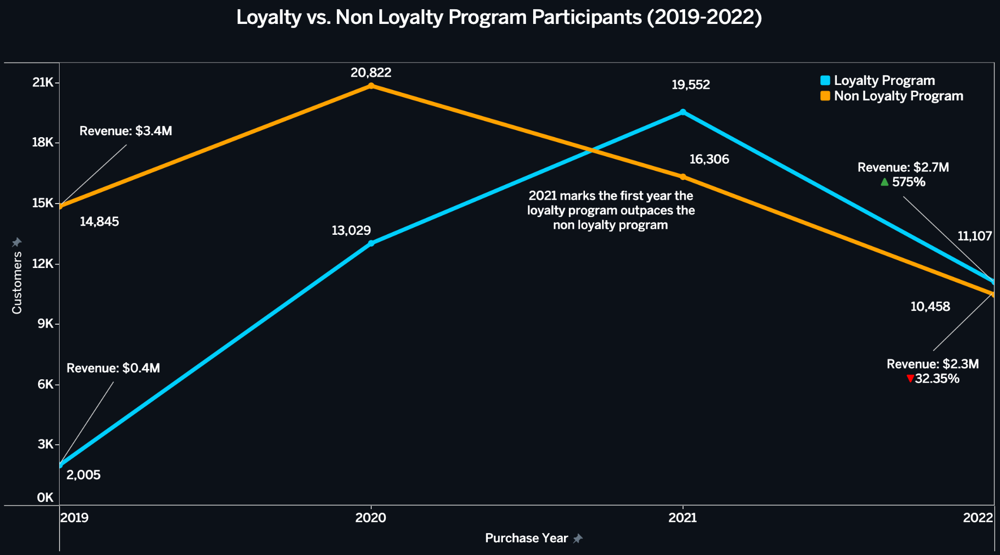
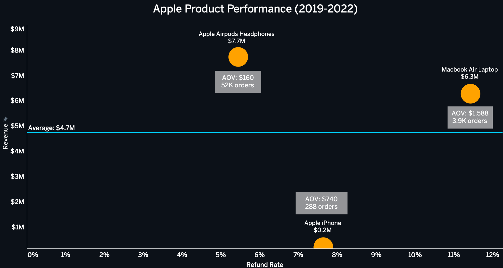

  

<table>
<tr>
<td width="50%" valign="top">
  
<h2 align = "center">Client Background</h2>

Vexon is an e-commerce company based in the U.S. that sells a variety of tech products and accessories. Launched in **2018**, Vexon has expanded to a global customer base, and has since faced a unique set of circumstances brought on by the **COVID-19 pandemic** and increased competition. 

As of **2023**, Vexon has processed over **100,000 transactions** and has generated **~$28M in revenue**. 

This analysis was conducted in response to a brief from the head of operations, to deliver insights across the company, including finances, sales and product. The scope of this analysis was set to **2019-2022**, with the insights and recommendations being based around the following:

<h3>NorthStar Metrics:</h3>

- **Sales Trends** (Monthly and Yearly): AOV, Order Count, Sales Revenue

- **Loyalty Program**: AOV, Order Count, Sales Revenue
  
- **Product Performance (Apple)**: Refunds/Refund Rate, AOV, Order Count, Sales Revenue

</td>
</tr>
</table>

<h1 align = "center"> ERD (Data Structure) </h1>

<h1 align="center">Executive Summary</h1>
<table width="100%" border="0" cellspacing="0" cellpadding="0" style="border-collapse: collapse;">
  <tr style="border: none;">
    <td width="62%" valign="top" style="border: none;">
      
    </td>
    <td width="38%" valign="top" style="padding-left: 20px; border: none;">
      <ul style="margin: 0; padding-left: 18px; line-height: 1.5;">
        <li style="margin-bottom: 10px;">
          Revenue more than doubled during the pandemic, growing from <strong>$3.8M (2019)</strong> to <strong>$10.1M (2020)</strong> and <strong>$9.1M (2021)</strong>, driven by increases in both <strong>AOV</strong> and <strong>order count</strong>.
        </li>
        <li>
          Revenue declined <strong>-46%</strong> to <strong>$4.9M</strong> as consumer behavior normalized. <strong>Q4</strong> experienced an abnormal drop despite historically strong holiday performance.
        </li>
      </ul>
    </td>
  </tr>
  <tr style="border: none;">
    <td width="62%" valign="top" style="border: none;">
      
    </td>
    <td width="38%" valign="middle" style="padding-left: 20px; border: none;">
      <ul style="margin: 0; padding-left: 18px; line-height: 1.5;">
        <li>
          Loyalty program grew from <strong>$0.4M</strong> to <strong>$2.7M (2019–2022)</strong>, with a <strong>+18% increase in AOV</strong>, outperforming the non-loyalty program in revenue in both <strong>2021</strong> and <strong>2022</strong>.
        </li>
      </ul>
    </td>
  </tr>
  <tr style="border: none;">
    <td width="62%" valign="top" style="border: none;">
      
    </td>
    <td width="38%" valign="middle" style="padding-left: 20px; border: none;">
      <ul style="margin: 0; padding-left: 18px; line-height: 1.5;">
        <li>
          Apple products account for <strong>~50% of revenue</strong>, but the <strong>iPhone</strong> contributes <strong><1% of sales</strong>, indicating weak validation for further catalog allocation.
        </li>
      </ul>
    </td>
  </tr>
</table>

<h1 align="center"> Yearly / Quarterly Sales Trends </h1>

  

<table>
<tr>
<td width="50%" valign="top">

    
 ### 2019: Quarterly Baseline:
- **2019** serves as a baseline year, reflecting typical business performance, as there are no external disruptions such as the pandemic or post-pandemic effects.
- **Q1** and **Q2** we see consistent monthly performance (**$246K–$362K**), with no significant spikes in sales.
- In **Q3** (back to school season), AOV and order count begin to increase. Increasing monthly revenue range to (**$318K–$372K**).
- **Q4** AOV and order count peak, resulting in a monthly revenue range of (**$305K–$458K**).

### 2020: Covid-Driven Inflection Point:
- **Q1** follows the usual e-commerce flow with units sold dropping (post-holiday).
- **March** (pandemic hits) and quarter to quarter a continuous upwards trend occurs in AOV, order count, and revenue.
- **Sept** and **Dec** both generate **$1M+** (pandemic and seasonal increase).
- **100.8% increase** in average units sold (**1,404 -> 2,820**), **30% increase** in AOV (**$229 -> $300**), and a **162% increase** in average monthly revenue (**$322K -> $845K**).
- The continuous upwards trend throughout the year resulted in a total of **$10.1M**, a record breaking year.

</td>

<td width="50%" valign="top">
  
### 2021: Normalization Period:
- The momentum of **2020** carries over into early **2021** with **Jan** also generating **$1M+**.
- In the following months a significant drop occurs. Revenue range falls between **$640K–$760K**.
- **Sept** and **Dec** surpass **$800K** due to a surge in units sold.
- **2021** outsold **2020** by **~2,000 units**. Despite that, less revenue was generated due to a **-15.33% decrease in AOV ($254)**.
- Overall, **2021** generated **$9.1M**, a **-10% decrease** from **2020**.

### 2022: Post-Pandemic Decline and Weak Q4 Performance:
- Again, the momentum carries over and **Jan** performs strongly (**$700K**).
- However, revenue drops by **$232K** in **Feb**, and from here the monthly revenue range falls into a range of (**$397K–$509K**).
- In **Q4** (typically the most successful period) we see our weakest quarter to date in terms of units sold, AOV, and revenue.
- Compared to **2021** average monthly revenue decreases **-45%** (**$758K -> $408K**), AOV decreases **-9.8%** (**$254 -> $229**).
- An overall **-46% decrease** in total revenue (**$9.1M -> $4.9M**).

</td>
</tr>
</table>

<h1 align="center">  Loyalty Program Performance </h1>

- For a company of our size the industry standard of loyalty program participation is **25-50%** (https://www.alexanderjarvis.com/what-is-loyalty-program-participation-rate-in-ecommerce/).
- Positioning us in the **upper range** of industry benchmarks.

  

<table>
<tr>

<td width="50%" valign="top">
    
## Performance Overview:

- Out of the **100k+ transactions** since **2019**, **42%** were done by loyalty program users and **58%** were done by non loyalty program customers. 
- Initial adoption for the loyalty program was very slow, with a total of **2,005 orders** and **$0.4M** in revenue.  
- Revenue grew from **$0.4M in 2019** to **$2.7M in 2022**, AOV also increased by **18%** (**$207 -> $244**). On the other hand, the non loyalty program saw a **-8% decrease in AOV** and revenue dropped from **$3.4M in 2019** to **$2.2M in 2022**.
- In **2021**, the loyalty program began to differentiate itself, growing revenue from **$3M** to **$4.8M**, while non loyalty revenue declined from **$7.1M** to **$4.2M** — the first year the loyalty program outperformed the non loyalty program.

<td width="50%" valign="top">
    
## Overall:

- The non loyalty program was outperformed in **units sold** and **revenue generated** in **2021** and by **AOV**, **units sold**, and **revenue generated** in **2022**.
- The loyalty program was able to hold onto and sustain some of the growth from the **pandemic-boom**, whereas the non loyalty program saw a hard decline.
- The loyalty program is showing **strong potential for long term growth** and despite its slow start has proven it's a valuable asset for long term gains in the company.

</td>

</tr>
</table>

<h1 align="center">  Apple Health Product Performance </h1>

- Due to data limitations this analysis was only able to be conducted using data from **2019-2021**.
- As of **2022**, there are **3 apple products** in the catalog; **Airpods**, **iPhone**, and the **Macbook Air**.

  

<table>
<tr>

<td width="50%" valign="top">

## Summary:
- The **Macbook Air** is the most expensive product with an AOV of **$1,588**, followed by the **iPhone** with an AOV of **$740**, and then the **Airpods** with an AOV of **$160**.
- Combined order count of all three products is **52,654**, and after refunded orders the total drops to **49,543** a **-6% decrease**. Of these orders the **Airpods** account for **92%**, the **Macbook Air 7%**, and the **iPhone 0.54%**.
- **Airpods** are the top-selling product, having an order count of **48,402 orders**. It also has a refund rate of **5.45%**, the lowest amongst all apple products.
- The **Macbook Air** is the second-best selling product in the Apple Catalog, with **3,964 orders**. It has the highest refund rate at **11.43%**.
- However, over the years its refund rate has decreased substantially. In **2019** it held a refund rate of **18.31%**, and in **2021** **6.33%** — a **12 percentage point decrease**.
- The **iPhone** is the lowest selling product in the apple catalog. Its refund rate has decreased over the years, **10.87% (2019) -> 5.26% (2021)**. However, its order count is so low that it doesn't make much of an impact.

## Apple Product Findings:
- Overall, the apple catalog has generated **$14.2M** in total revenue. Making up **50%** of the overall revenue the business has generated.
- **Airpods** account for **$7.7M**, **Macbook Air** for **$6.2M** and the **iPhone** for **$0.2M**.
- In terms of refund rate, the higher the ticket the item, the more likely it will be returned. As we start seeing higher prices, the refund rate also begins to shoot up (**5.45% (Airpods) -> 7.64% (iPhone) -> 11.43% (Macbook)**). This is due to customers having higher expectations for premium products making them more likely to return them when those expectations aren't met.
- The **iPhone** should be **removed or replaced** in the catalog. There is no real customer demand for this product from us and focusing this effort towards introducing a new apple product would be beneficial.

</td>

</tr>
</table>
  

<h1 align="center">  Insights and Recommendations </h1>

## Future Tasks:
- Further investigate the **Q4 sales anomaly in 2022**. Decipher what caused this decline as this is historically our most prominent period. Investigate whether this was due to **increased competition**, **ineffective marketing strategies**, or if it was a continued effect from the decrease of the **online shopping boom** from pandemic-driven shopping behavior.

## Recommendations:
- **Q3** and **Q4** perform the best for us. During this period we need to increase marketing through **ad spend** and **organic content**. Also look into introducing **back to school** and **holiday deals**; (bundles, sales, student discounts, etc.). In parallel we should be pushing the **loyalty program** onto the increased customer arrival during these periods.

- **January** is a sleeper month and often gets overlooked due to the decrease in spend that occurs right after, and the usual view that shopping is going to decrease as the winter holidays are coming to an end. However, **January performs well for us** and we should be taking advantage of the continued performance through marketing and deals. We need to keep our foot on the gas a little after **Q4** to get the most out of **January** that we can.

- The **loyalty program** has proven its value to our company and we need to preserve and expand that. Work on increasing **loyalty program signups** by offering **incentives**, sending **targeted email campaigns** and deals on **high ticket items** like the **Macbook Air**. This will in parallel increase the **loyalty program participation/performance** and prompt more customers to purchase higher ticket items thus increasing the **order count**.

- The **apple product catalog** has performed very well, but one product has been acting as a placeholder, that product being the **iPhone**. The **iPhone** has gained little to no traction over the years with **insufficient customer demand** to justify its catalog placement. By introducing a different apple product that is similar to the **Airpods** or the **Macbook**. Customers appear to prefer purchasing the **iPhone** elsewhere, but don't mind purchasing **Airpods** or **Macbooks** from us. Hence, our next product introduction should be something similar to these two like the **Apple Watch** or the **iPad**. Currently, the **Apple Watch** is the safer bet as it serves as a direct accessory to the **iPhone** just as the **Airpods** do, which is our best selling product.
